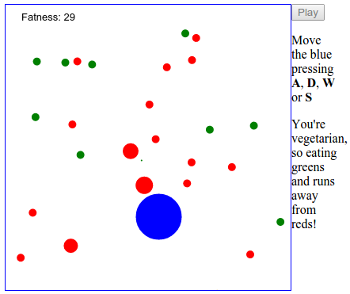

#lang-def
[](https://travis-ci.org/sapienlab/lang-def)

Lightweight utility module for creating javascript *classes*.


> copyright [xkcd](http://xkcd.com/927/)

Ok, Javascript already uses OOP, but based in prototypes. It is not bad, but occasionally 
the class system is the best approach. This library help you to create "raw vanilla" 
Javascript classes, for the best integrating with another codes and libraries with 
the best performance.

#Features
- Great performance.
- Works in node.js and browsers
  - In node.js use the native [inherits](http://nodejs.org/docs/latest/api/util.html#util_util_inherits_constructor_superconstructor).
  - Use ES5 if is available, or the legacy way in legacy environment (cough cough IE<9).
- Support to classic inhiterance.
- Support to mixins.
- Support to CommonJs (like node.js), AMD (like requireJs) and as vanilla global module.
- Secure. If you forget to use the "new" operator to instantiate then TypeException is fired, so not fail silently.
- Elegant API & clean code base.

#Quick Example
```javascript
var def = require('def')

var Point = def({
	new: function (x, y) {
		this.x = x;
		this.y = y;
	},
	distance: function (p) {
		return Math.sqrt(
			Math.pow(p.x - this.x, 2) +
			Math.pow(p.y - this.y, 2)
		)
	}
})

var a = new Point(2, 4)
var b = new Point(5, -6)

a.distance(b);
// -> 10.44030650891055
```
[`jsfiddle.net/d0y6jLv5/`](http://jsfiddle.net/d0y6jLv5/)

#Installation
[npm][]:
```sh
$ npm install lang-def
```
[bower][]:
```sh
$ bower install lang-def
```

Or simply [download](https://github.com/sapienlab/lang-def/archive/master.zip).

##Import

###In CommonJS (like node.js)
```node
var def = require('lang-def')
```
###In AMD (like requireJS)
```javascript
require.config({
    paths: {
        def: 'libs/lang-def/def'
    }
});
```
Then simply use
```javascript
require(['def'], function (def) {
	// use def
});
```
###In vanilla (like simple web page)
```html
<script src="my_path/lang-def/def.js"></script>
<script>
	// use window.def or simply def
</script>
```
#API
##def
Creates a constructor function (*Class*).

Signature:
```node
def([ string name ], [ function BaseClass ], [ array mixins ], [ object props ])
 -> Function
```
- *optional string* **name**:
	- The name of the class. Useful for debugging.
	- default: `undefined`, but resolved to `'AnonymousConstructor'`.
	- limitations:
		- Must be compilant with the general rules for Javascript variables,
		i.e. `'Person'`, `'SuperPerson'`. Not `'persons.Person'` or `2Person`.
		- Is compatible with [Chrome Extensions](https://developer.chrome.com/extensions/contentSecurityPolicy#relaxing-eval),
		but not with [Chrome Apps](https://developer.chrome.com/apps/contentSecurityPolicy#what), so for developing Chome Apps omit the name. This restriction is due to the use of `new Function(...)` to generate the name
		in the runtime.
- *optional function* **BaseClass**:
	- The parent constructor in the classic [inhiterance](https://developer.mozilla.org/en-US/docs/Web/JavaScript/Guide/Inheritance_and_the_prototype_chain).
	- default: `undefined`, by definition inherits from `Object`.
	- limitations:
		- Can be a constructor function (*Class*) created by `def` or by vanilla javascript.
		- Currently no work well for DOM Interfaces, like HTMLDivElement.
- *optional array* **mixins**:
	- An array of constructor functions that is *mixed* from left to right (the right overrides the left).
	- default: `[ ]`
	- limitations:
		- The same of **BaseClass**.
- *optional object* **props**:
	- The properties or members of the Class to create.
	- default: `{ }`
	- especial members:
		- *optional function* **new**: is the `constructor`.
			- default: `function () { def.mixin(this, arguments); }`.
		- (in each method) **this.fn(function Class [, string methodName])**:
			- return the function `methodName` of `Class` in the `this` clausure.
			parent method with the given arguments and return the results.
	- limitations:
		- Must not contain one of the follows special members: 
		**mixins_**, **super_** and **fn**.

#Examples
##A little Game Egine



See in [`jsfiddle.net/mnrtag0v/8`](http://jsfiddle.net/mnrtag0v/8/).

##Classic examples
###Inheritance
```javascript

var Animal = def({
	name: null,
	speak: function () { return 'I am ' + this.name; }
});

var Cat = def(Animal, {
	speak: function() {
		return this.fn(Animal, 'speak') + ', the Cat';
	}
});

var Dog = def(Animal, {
	speak: function() {
		return this.fn(Animall, 'speak') + ', the Dog';
	}
});

var cat = new Cat({ name: 'Canela' });
var dog = new Dog({ name: 'Doky' });

cat instanceof Cat;
// -> true
cat instanceof Animal;
// -> true

dog instanceof Dog;
// -> true
dog instanceof Animal;
// -> true

cat.speak();
// -> 'I am Canela, the Cat'

```
[`jsfiddle.net/spL1fvzc/1`](http://jsfiddle.net/spL1fvzc/1/)

###Mixins
Example inspired from [dgrid](http://dgrid.io/)
```javascript
var Widget = def({ ... });
var Grid = def(Widget, { ... });

var Sortable = def({ ... });
var Selectable = def({ ... });
var Resizable = def({ ... });

// Then we need a sortable grid
var MySortableGrid = def(Grid, [Sortable]);

// Then we need a sortable and selectable grid
var MySortableAndResizable = def(Grid, [Sortable, Selectable]);

// one grid
var grid = new MySortableAndResizable({ ... });

grid instanceof Grid; // -> true
grid instanceof Widget; // -> true
grid instanceof Sortable; // -> false
grid instanceof Selectable; // -> false

def.instanceOf(grid, Grid); // -> true
def.instanceOf(grid, Widget); // -> true
def.instanceOf(grid, Sortable); // -> true, because is Mixin
def.instanceOf(grid, Selectable); // -> true, because is Mixin

def.mixinOf(grid, Grid); // -> false
def.mixinOf(grid, Widget); // -> false
def.mixinOf(grid, Sortable); // -> true
def.mixinOf(grid, Selectable); // -> true

```
##def.mixin
Mixin **arg0** with **arg1**, then with **arg2** (if exits), etc.

Signature:
```javascript
def.mixin(object arg0 [, object arg1 [, ... ]]) -> object
```
- *object* **arg0**
- ...

The **arg0** object is mutated and returned.

##def.mixinOf
Check if instance is mixin of Mixin.

Signature:
```javascript
def.mixinOf(object instance, function Mixin) -> bool
```
- *object* **instance**
- *function* **Mixin**

##def.instanceOf
Check if instance is instance or mixin of MixinOrClass.

Signature:
```javascript
def.instanceOf(object instance, function MixinOrClass) -> bool
```
- *object* **instance**
	- the object to check
	- limitations: none
- *function* **MixinOrClass**
	- the constructor function
	- limitations: none, can be a vanilla function.

#Best  Practies & Tips
- Feel free to use `def` with vanilla constructor functions and in library proyects. `def` just construct a vanilla constructor, so is not intrusive.
- In CommonJS or AMD environment use one file per *Class*.
- Use the conventional prefix `_` for private members. Example `_lastPosition: 5`.
	We can over engineering this lib for have a *real* private concept, but
	then we like some way for made reflection... so, [KISS](http://en.wikipedia.org/wiki/KISS_principle) is the better.
- To define *static* properties add them to the constructor. i.e. `XHR = def(...); XHR.TYPE_OK = 1; XHR.TYPE_ERR = 0`.

#TODO
- [x] Experimenting................100%
- [x] Writing the code.............100%
- [x] Anecdotally Testing..........100%
- [ ] Automated Testing on Travis..75%
- [x] Documenting the API..........90%

#LICENSE
MIT LICENSE

[npm]: http://npmjs.org/
[bower]: http://bower.io/